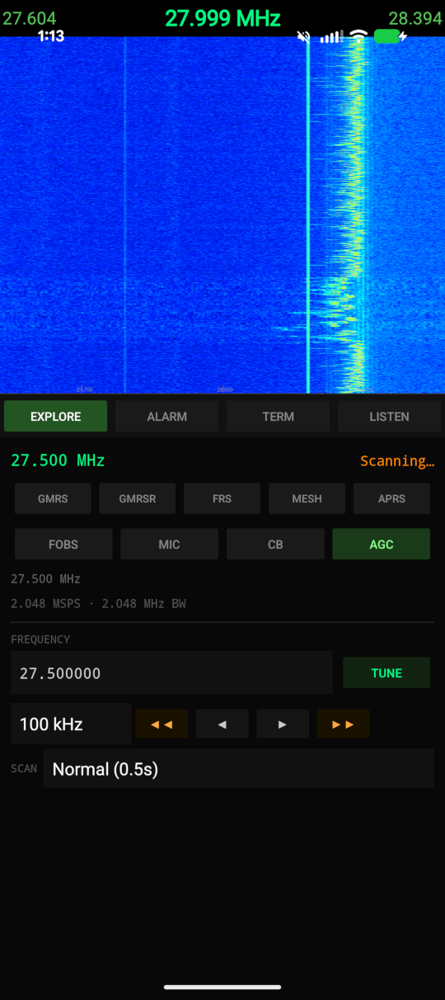
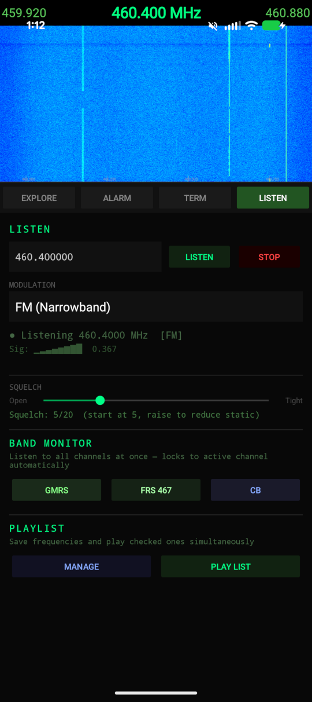

# RavenSDR

A lightweight, purpose-built Android app for monitoring radio frequencies with an RTL-SDR USB dongle. RavenSDR provides a live waterfall display, wideband spectrum scanning, FM/AM demodulation, squelch-controlled listening, and signal-alert notifications — all without requiring root access.

Tested on **Android 14** and **Android 17 beta**.

---

## Credits

RavenSDR builds on the work of several open source projects:

| Project | Author / Maintainer | License | Use in RavenSDR |
|---------|-------------------|---------|-----------------|
| [librtlsdr](https://github.com/osmocom/rtl-sdr) | Osmocom community | GPL-2.0 | RTL2832U chip initialisation and IQ sample streaming |
| [libusb](https://libusb.info) | libusb contributors | LGPL-2.1 | USB Host communication on unrooted Android |
| [KissFFT](https://github.com/mborgerding/kissfft) | Mark Borgerding | BSD-3-Clause | FFT for live spectrum and waterfall computation |
| [SDRTrunk](https://github.com/DSheirer/sdrtrunk) | Dennis Sheirer | GPL-3.0 | Waterfall colour palette design |

---

## Screenshots

<p float="left">
  
  &nbsp;&nbsp;
  
</p>

---

## Table of Contents

- [Features](#features)
- [Hardware Requirements](#hardware-requirements)
- [Development Environment Setup](#development-environment-setup)
- [Project Structure](#project-structure)
- [Native Libraries](#native-libraries)
- [Troubleshooting](#troubleshooting)
- [Supported Android Versions](#supported-android-versions)
- [License](#license)

---

## Features

### Explore
- **Live waterfall display** — colour-mapped FFT spectrum updated in real time at 2.048 MSPS
- **Band presets** — one-tap access to GMRS (CH 1–7, 15–22), GMRS repeater inputs, FRS (CH 8–14), CB (40 channels), APRS 2m, 915 MHz ISM / Meshtastic, 434 MHz FOBS/LoRa, and 650 MHz wireless mics
- **Explore mode** — tune anywhere from 500 kHz to 1766 MHz in configurable steps (100 Hz – 1 MHz)
- **Wideband scan** — automatically sweeps across all channels in a band; configurable dwell time

### Listen
- **NFM and AM demodulation** — narrowband FM and amplitude modulation with real-time audio output
- **Squelch control** — adjustable threshold silences the receiver between transmissions
- **Band Monitor** — listens across all channels in a band simultaneously and locks when a signal is found
- **Playlist** — save named frequencies and play them back sequentially or manage them as a list

### Alarms
- **Signal alerts** — configurable dB threshold triggers an audible radar ping
- **Alert history log** — tap any entry to jump directly to that frequency in Listen mode

### General
- **Bookmarks** — save and load named frequencies, shared between Explore and Listen tabs
- **AGC / manual gain** — toggle between automatic gain control and 30 dB fixed gain
- **Auto-launch** — app opens automatically when an RTL-SDR dongle is plugged in via USB OTG
- **Supported hardware** — RTL2832U family: standard RTL2832U, RTL2838, RTL2831, RTL2833, RTL2837, and RTL-SDR Blog V4

---

## Hardware Requirements

| Item | Notes |
|------|-------|
| Android device | Android 8.0 (API 26) or higher; USB Host support required |
| RTL-SDR dongle | Any RTL2832U-based device; RTL-SDR Blog V4 recommended |
| USB OTG cable or adapter | Micro-USB or USB-C to USB-A female, matching your phone |
| Antenna | SMA antenna appropriate for your target frequency band |

No root access is required. The app uses Android's built-in USB Host API.

---

## Development Environment Setup

### Prerequisites

| Tool | Version | Notes |
|------|---------|-------|
| Android Studio | Ladybug (2024.2) or newer | [Download](https://developer.android.com/studio) |
| Android NDK | r27 LTS or newer | Installed via Android Studio SDK Manager |
| CMake | 3.22.1 or newer | Installed via Android Studio SDK Manager |
| JDK | 11 | Bundled with Android Studio |

### 1. Install Android Studio

Download and install Android Studio from [developer.android.com/studio](https://developer.android.com/studio). During first-run setup, accept all SDK licenses when prompted.

### 2. Install NDK and CMake via SDK Manager

In Android Studio:

1. Open **File → Settings** (macOS: **Android Studio → Settings**)
2. Navigate to **Appearance & Behavior → System Settings → Android SDK**
3. Select the **SDK Tools** tab
4. Check **NDK (Side by side)** — install version **r27 LTS** or newer
5. Check **CMake** — install version **3.22.1** or newer
6. Click **Apply** and let the installation finish

Alternatively, install via the command line (adjust the path to your SDK):

```bash
# Linux / macOS
sdkmanager "ndk;27.2.12479018" "cmake;3.22.1"

# Windows (run from the SDK tools directory)
sdkmanager.bat "ndk;27.2.12479018" "cmake;3.22.1"
```

### 3. Clone the Repository

```bash
git clone https://github.com/JamesBurnettHQ/RavenSDR.git
cd RavenSDR
```

> The repository includes the native library sources (libusb, librtlsdr, kissfft) as vendored copies under `app/src/main/cpp/`. No separate submodule initialisation is needed.

### 4. Open in Android Studio

1. Launch Android Studio
2. Choose **File → Open** and select the cloned `RavenSDR` directory (the one containing `settings.gradle`)
3. Wait for Gradle sync to complete — Android Studio will download all Java/Kotlin dependencies automatically
4. If prompted about a missing local NDK path, open **File → Project Structure → SDK Location** and confirm the NDK path is detected correctly

### 5. Build and Install

#### Via Android Studio (recommended)

1. Connect your Android device via USB and enable **USB Debugging** in Developer Options
2. Select your device from the target device dropdown in the toolbar
3. Click **Run ▶** (or press `Shift+F10`) to build and install the debug APK

#### Via Gradle command line

```bash
# Debug build and install on connected device
./gradlew installDebug

# Release APK — requires KEYSTORE_PATH, KEYSTORE_PASS, KEY_ALIAS, KEY_PASS env vars
./gradlew assembleRelease

# Windows
gradlew.bat installDebug
```

The first build compiles three native static libraries (libusb, librtlsdr, kissfft) and one JNI shared library (`librtlsdr_android.so`) for `arm64-v8a` and `x86_64`. This takes several minutes. Subsequent builds are incremental.

---

## Project Structure

```
RavenSDR/
├── app/
│   ├── build.gradle                  # App-level Gradle config, NDK/CMake wiring
│   └── src/main/
│       ├── AndroidManifest.xml       # USB host feature, USB device filter
│       ├── cpp/
│       │   ├── CMakeLists.txt        # Native build: libusb + librtlsdr + kissfft → JNI .so
│       │   ├── rtlsdr_jni.cpp        # JNI bridge: Java ↔ librtlsdr
│       │   ├── libusb/               # libusb 1.x (Android Linux backend, no udev)
│       │   ├── librtlsdr/            # librtlsdr (RTL2832U driver)
│       │   └── kissfft/              # KissFFT (lightweight FFT for spectrum computation)
│       ├── java/com/ravensdr/
│       │   ├── MainActivity.java     # UI, tab routing, USB and DSP lifecycle
│       │   ├── UsbHelper.java        # USB Host permission and device attachment
│       │   ├── RtlSdrDriver.java     # JNI wrapper around librtlsdr
│       │   ├── DspEngine.java        # IQ → FFT pipeline, continuous scan thread
│       │   ├── ListenEngine.java     # NFM/AM demodulation, squelch, channel scanner
│       │   ├── WaterfallView.java    # Custom View: waterfall + channel markers + alert
│       │   ├── SpectrumView.java     # Custom View: spectrum overlay
│       │   ├── GMRSChannels.java     # Frequency tables for all supported bands
│       │   └── ConsoleLogger.java    # In-app debug log (visible on Console tab)
│       └── res/
│           ├── layout/activity_main.xml
│           └── xml/usb_device_filter.xml   # RTL2832U USB VID/PID list
├── screenshots/                      # App screenshots for README
├── build.gradle                      # Root Gradle file (AGP version)
├── settings.gradle                   # Project name, repository declarations
├── gradle.properties                 # JVM heap, AndroidX, parallel builds
└── gradlew / gradlew.bat             # Gradle wrapper scripts
```

---

## Native Libraries

RavenSDR bundles vendored copies of three C libraries that are compiled from source by the Android NDK:

| Library | Version | License | Purpose |
|---------|---------|---------|---------|
| [libusb](https://libusb.info) | 1.x | LGPL-2.1 | USB Host communication without kernel driver on Android |
| [librtlsdr](https://github.com/osmocom/rtl-sdr) | mainline | GPL-2.0 | RTL2832U chip initialisation and IQ sample streaming |
| [KissFFT](https://github.com/mborgerding/kissfft) | mainline | BSD-3-Clause | Fast Fourier Transform for spectrum computation |

libusb is configured with the Android Linux/usbfs backend (no udev, no netlink) so it works on unrooted devices using Android's `UsbManager.openDevice()` file descriptor.

---

## Troubleshooting

| Symptom | Fix |
|---------|-----|
| "No RTL-SDR — plug in dongle" | Check the OTG cable; try a different USB port or cable |
| "USB permission denied" | Tap **OK** on the system permission dialog; revoke and re-grant from App Settings if it doesn't appear |
| "Init failed: …" | Unplug the dongle, wait 3 seconds, and plug it back in |
| Black waterfall | Dongle is initialising; wait 2–3 seconds after connecting |
| Waterfall freezes | DSP engine will auto-retry up to 3 times; if it fails, unplug and restart |
| No audio in Listen mode | Raise the phone media volume; check squelch level (start at 5, lower if no audio) |
| Build error: NDK not found | Install NDK via SDK Manager (see step 2 above) |
| CMake version mismatch | Install CMake 3.22.1+ via SDK Manager |

---

## Supported Android Versions

| Android Version | API Level | Status |
|----------------|-----------|--------|
| Android 8.0 – 8.1 | 26 – 27 | Minimum supported |
| Android 9 – 13 | 28 – 33 | Supported |
| Android 14 | 34 | Tested ✓ |
| Android 17 beta | 37 | Tested ✓ |

---

## License

RavenSDR is released under the **GNU General Public License v3.0** — see [LICENSE](LICENSE) for the full text.

The bundled libraries retain their own licenses:
- librtlsdr: GPL-2.0
- libusb: LGPL-2.1
- KissFFT: BSD-3-Clause
